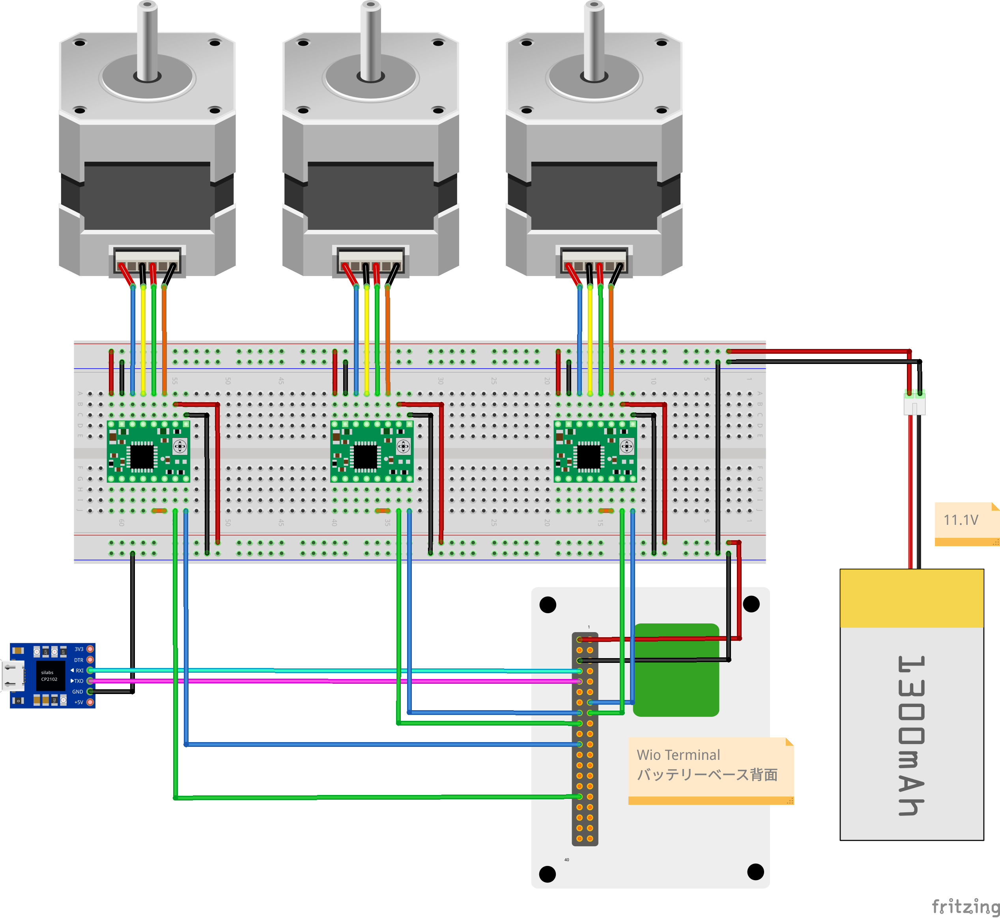

# 加速運動

ゆっくりとした速度から、段々と速くしていきます。

## 使用パーツ

* [Wio Terminal](https://www.switch-science.com/catalog/6360/)
* [Wio Terminal バッテリーベース](https://www.switch-science.com/catalog/6816/)
* [バイポーラ・ステッピングモータ](https://jp.misumi-ec.com/vona2/detail/221005433134/?HissuCode=SS2421-5041)
* [A4988 ステッピングモータ・ドライバ・モジュール](https://amzn.to/39Z4EZu)
* [LiPoバッテリー](https://amzn.to/3DF7PCH)
* [USBシリアル変換モジュール(通販コード:M-11007)](https://akizukidenshi.com/catalog/g/gM-11007/)

## ブレッドボードで接続する場合の接続図

