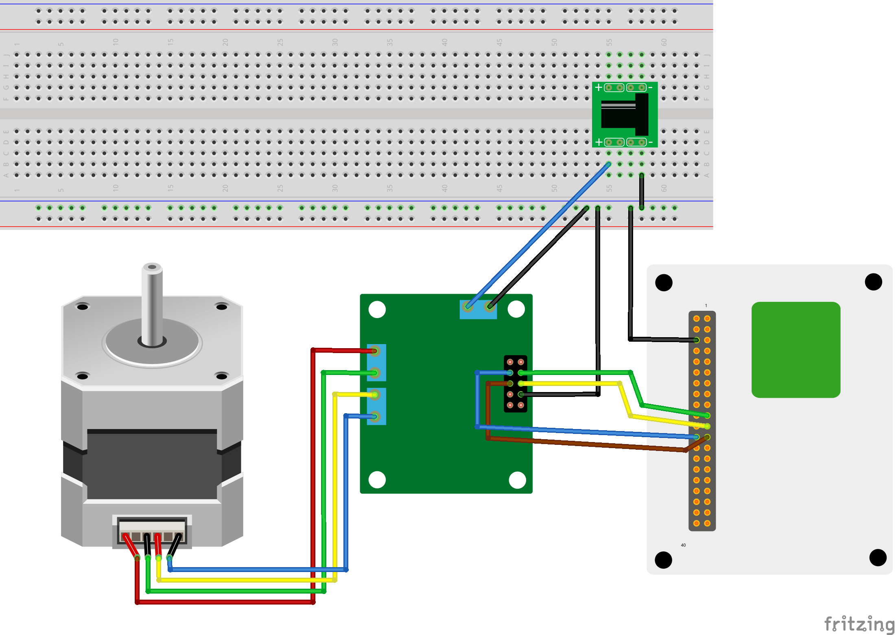

# Wio Terminalとブレッドボードを接続して、ステッピングモータを動かします。

ステップ数を指定して動かします。

使用部品
* バイポーラ　ステッピングモーター　ＳＭ－４２ＢＹＧ０１１(秋月電子通販コード: P-05372)
* Ｌ６４７０使用　ステッピングモータードライブキット(秋月電子通販コード: K-07024)

## ブレッドボードとの接続

Wio Teraminalのピンは、説明書参照。

| ピンNo. | 説明     | ASTAMD51P19A パッド |
| ------- | -------- | ------------------  |
| 19      | SPI_MOSI | PB02/SERCOM5.0      |
| 21      | SPI_MISO | PB00/SERCOM5.2      |
| 23      | SPI_SCLK | PB03/SERCOM5.1      |
| 24      | SPI_CS   | PB01/SERCOM5.3      |

## 参考情報

* [L6470使用　ステッピングモータードライブキットの取扱説明書](https://akizukidenshi.com/download/ds/akizuki/AE-L6470_20190118.pdf)
* [L6470データシート](https://akizukidenshi.com/download/ds/st/L6470.pdf)
