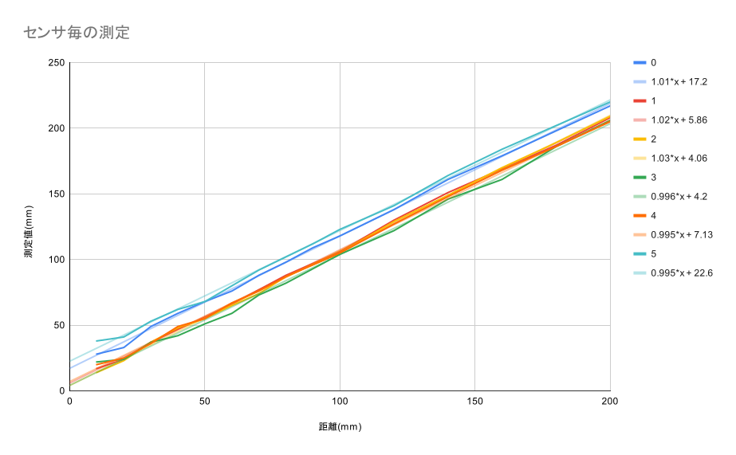
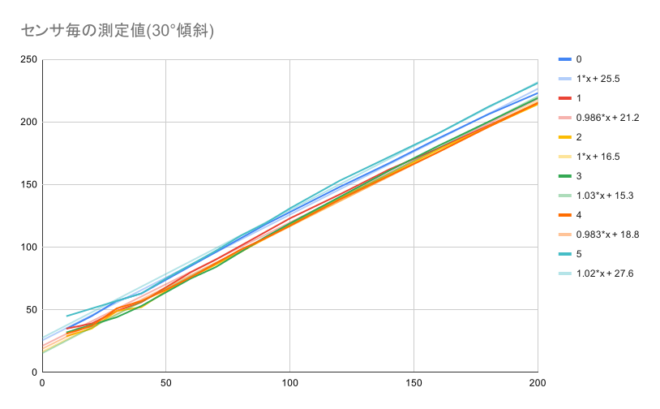

# TOFセンサー

連続測定モードで測定し、指数平滑平均で表示する。

壁が直角



| 距離(mm) | センサ0 | センサ1 | センサ2 | センサ3 | センサ4 | センサ5 |
| -------- | ------- | ------- | ------- | ------- | ------- | ------- |
| 10 | 28 | 17 | 14 | 22 | 20 | 38 |
| 20 | 33 | 24 | 23 | 24 | 25 | 41 |
| 30 | 49 | 37 | 37 | 37 | 36 | 53 |
| 40 | 59 | 47 | 48 | 42 | 49 | 62 |
| 50 | 68 | 56 | 55 | 51 | 55 | 68 |
| 60 | 76 | 66 | 65 | 59 | 67 | 80 |
| 70 | 88 | 77 | 74 | 73 | 76 | 92 |
| 80 | 98 | 88 | 87 | 82 | 87 | 102 |
| 90 | 109 | 97 | 96 | 93 | 96 | 112 |
| 100 | 118 | 106 | 105 | 104 | 105 | 123 |
| 120 | 138 | 130 | 129 | 122 | 127 | 141 |
| 140 | 161 | 151 | 149 | 146 | 148 | 164 |
| 160 | 179 | 169 | 170 | 161 | 168 | 184 |
| 180 | 198 | 187 | 189 | 186 | 186 | 202 |
| 200 | 217 | 208 | 209 | 206 | 205 | 220 |

壁が30°傾斜




| 距離(mm) | センサ0 | センサ1 | センサ2 | センサ3 | センサ4 | センサ5 |
| -------- | ------- | ------- | ------- | ------- | ------- | ------- |
| 10 | 35 | 35 | 29 | 32 | 31 | 45 |
| 20 | 45 | 39 | 35 | 38 | 37 | 51 |
| 30 | 57 | 49 | 49 | 44 | 51 | 57 |
| 40 | 63 | 56 | 52 | 53 | 57 | 63 |
| 50 | 74 | 68 | 65 | 64 | 66 | 75 |
| 60 | 85 | 80 | 76 | 75 | 76 | 86 |
| 70 | 96 | 90 | 86 | 84 | 87 | 97 |
| 80 | 107 | 101 | 96 | 96 | 98 | 109 |
| 90 | 118 | 112 | 107 | 108 | 107 | 119 |
| 100 | 128 | 123 | 118 | 119 | 117 | 131 |
| 120 | 148 | 142 | 139 | 140 | 138 | 153 |
| 140 | 167 | 162 | 158 | 161 | 157 | 172 |
| 160 | 187 | 179 | 178 | 181 | 176 | 191 |
| 180 | 206 | 197 | 196 | 200 | 196 | 212 |
| 200 | 223 | 215 | 214 | 219 | 215 | 231 |

## 使用パーツ

* [Wio Terminal](https://www.switch-science.com/catalog/6360/)
* [Wio Terminal バッテリーベース](https://www.switch-science.com/catalog/6816/)
* [ToF レーザーモジュール(VL53L0X)](https://www.amazon.co.jp/gp/product/B08NDN4L9H/)
* [Grove 8チャンネルI2Cマルチプレクサ/I2Cハブ(TCA9548A)](https://eleshop.jp/shop/g/gK2C313/)
* [USBシリアル変換モジュール(通販コード:M-11007)](https://akizukidenshi.com/catalog/g/gM-11007/)

## ブレッドボードで接続する場合の接続図


## 測定値をパソコンで確認

Linuxの場合:

minicomをインストールして、以下のコマンドを実行します。

```bash
minicom -D /dev/ttyUSB0
```
