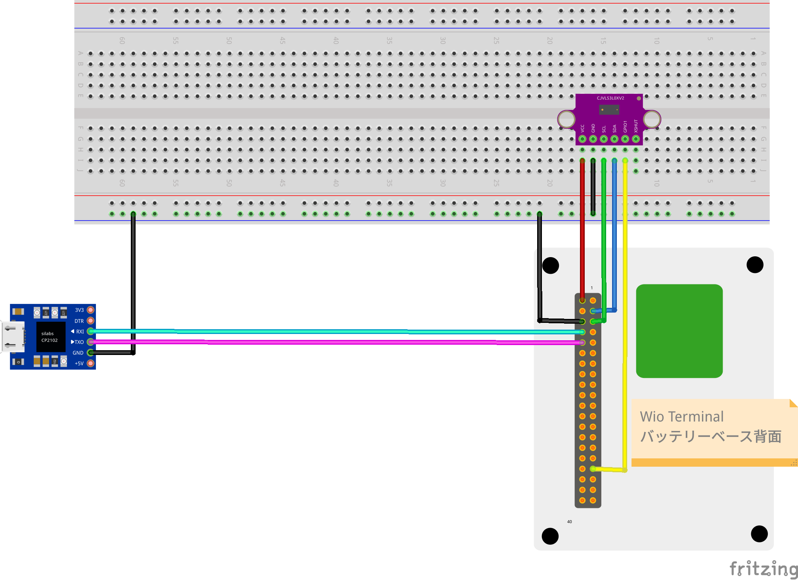

# TOFセンサー

連続測定モードで測定

## 使用パーツ

* [Wio Terminal](https://www.switch-science.com/catalog/6360/)
* [Wio Terminal バッテリーベース](https://www.switch-science.com/catalog/6816/)
* [ToF レーザーモジュール(VL53L0X)](https://www.amazon.co.jp/gp/product/B08NDN4L9H/)
* [USBシリアル変換モジュール(通販コード:M-11007)](https://akizukidenshi.com/catalog/g/gM-11007/)

## ブレッドボードで接続する場合の接続図




## 測定値をパソコンで確認

Linuxの場合:

minicomをインストールして、以下のコマンドを実行します。

```bash
minicom -D /dev/ttyUSB0
```